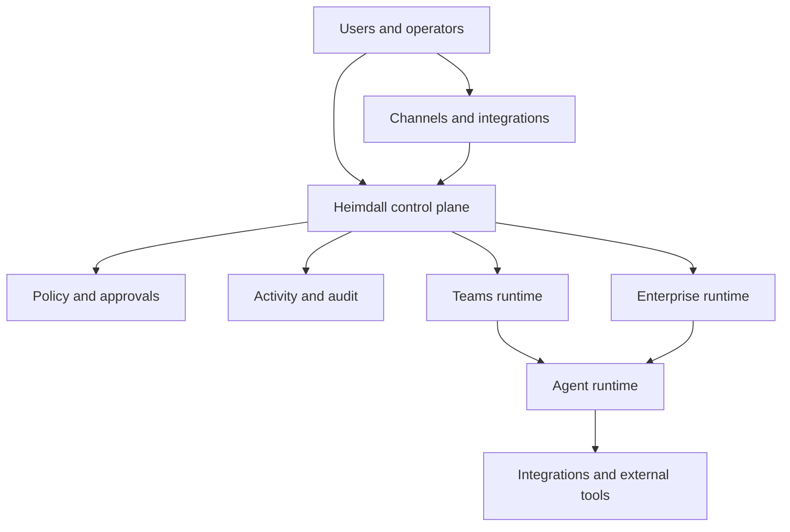

# Heimdall

**Security, observability and governance for broad-access AI agents.**

Heimdall is the trust layer that sits above an agent runtime. It gives teams the
isolation, visibility, governance and auditability needed to hand agents real
access to real systems.

## The problem

Once an agent can read real data, call real tools, message real users and take
actions across connected systems, the question stops being "can it run?" and
becomes "can we trust it?"

Answering that means solving isolation, visibility, governance, security and
auditability at once, and most teams end up building all five by hand.

| | Without Heimdall | With Heimdall |
| --- | --- | --- |
| Isolation | Shared runtime, weak boundaries, cross-tenant risk | Tenant, department and per-user boundaries with isolated runtimes and scoped memory |
| Visibility | Agents behave like black boxes | Activity timelines, traces, runtime and security events |
| Governance | Ad hoc permissions | RBAC, scoped roles, policy defaults, approval workflows |
| Security | Prompt injection, tool abuse, secret leakage | Ingress scanning, execution controls, egress checks |
| Auditability | No system of record | Audit events tied to users, agents and actions |
| Channels | Slack, WhatsApp and Telegram become bespoke security work | Governed channels, scoped connectors, approval-gated actions |

## How it fits together



- **Control plane** owns tenancy, users, departments, roles, policy defaults,
  approvals, channels, connectors and runtime orchestration.
- **Proxy** mediates requests into the runtime, runs ingress checks, correlates
  events and persists activity and audit records.
- **Runtime** runs `heimdall-agent` plus the agent runtime inside an isolated
  execution environment.
- **Channels** handle inbound and outbound delivery across Slack, WhatsApp,
  Telegram and related systems.
- **Connectors** register and govern the external tools agents can reach.
- **Policy and approvals** decide what runs automatically, what is blocked and
  what needs a human.
- **Activity and audit ledgers** record what agents did and what organizations
  need to prove happened.

## Isolation

Two runtime tiers, picked by how hard the boundary needs to be:

- **Teams** runs agents in Docker containers for container-level isolation.
- **Enterprise** runs each agent in a Firecracker microVM, hardware-virtualized
  with its own kernel.

Above the runtime, boundaries are explicit: tenant isolation, department
isolation, per-user agent boundaries, layered memory scopes that never collapse
into one flat context pool, and tenant-scoped credentials.

## Repository layout

```
api/          HTTP API surface
cmd/          heimdall (control plane) and heimdall-agent (runtime agent)
internal/     orchestrator, proxy, policies, approvals, rbac, tenant,
              channels, connectors, audit, activity, sentinel, auth, lifecycle
dashboard/    web dashboard
migrations/   database migrations
deploy/       deployment manifests
docs/         architecture, product overview, runbooks, plans
```

## Docs

- [Architecture](docs/architecture.md)
- [Product overview](docs/product-overview.md)
- [Runbooks](docs/runbooks/)

## Status

In active development. Go 1.x, Postgres, Docker and Firecracker.
